# 8-Puzzle Game solver

## Overview

We implemented search algorithms to solve the 8-puzzle problem. The 8-puzzle consists of a 3x3 board with 8 numbered tiles and one blank space (0). The objective is to arrange the tiles in ascending order, with the blank tile at the last position, by sliding tiles into the blank space. The program starts from an initial configuration and aims to reach the goal state.

## **User Interface**

The user interface for the **8-Puzzle Solver** is designed with simplicity and functionality in mind, offering a clean layout for users to interact with the puzzle-solving tool
****

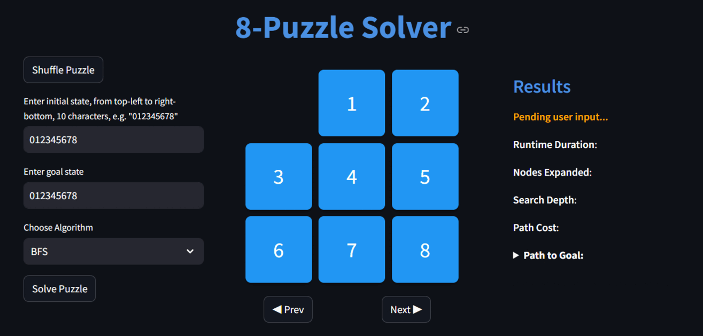
- **Puzzle Control Options**:
    - **Shuffle Puzzle Button**: randomize the initial puzzle
    - **Input Fields for States**:
        - **Enter Initial State**: Users can manually enter the initial state of the puzzle using a 9-character string (e.g., "012345678")
        - **Enter Goal State**: Users can enter their desired goal state , to make it flexible in solving various  states.
- **Choose Algorithm Dropdown**:
    - This dropdown menu lets users select the search algorithm they want to use to solve the puzzle (e.g., BFS, DFS).
- **Solve Puzzle Button**:
    - Once the initial state, goal state, and algorithm are set, the **Solve Puzzle** button starts the selected algorithm, generating the solution path and associated statistics.
- **Prev and Next Buttons**: These navigation buttons enable users to step through the solution path, viewing each intermediate state leading to the goal.
- **Results Panel**:
    - **Pending User Input**: when the system is waiting for the user to initiate the solving process.
    - **Runtime Duration**: time taken to solve the puzzle.
    - **Nodes Expanded**:  total number of nodes expanded during the search.
    - **Search Depth**: Indicates the maximum depth of the search tree
    - **Path Cost**: Reflects the cost of reaching the goal state (depth of the goal)
- **Dark/Light Mode Toggle**: from settings you can choose your preferred mode

## Algorithms Used

### 1. BFS (Breadth-First Search)

- **Data Structure Used**: **Queue** (specifically a `collections.deque`): Used to store the frontier nodes
- **Explanation**:
    - BFS explores nodes level-by-level, expanding all nodes at the current depth before moving to the next level. This ensures the shortest path is found, as BFS will reach the goal state in the fewest moves possible if a solution exists.

### 2. DFS (Depth-First Search)

- **Data Structure Used**: **Stack** (using `deque` ): DFS use it as LIFO to store the frontier nodes
- **Explanation**:
    - DFS goes deep into each path until it reaches a dead end or the goal. It’s memory-efficient but may not find the shortest path if a shorter path exists in a different branch.

### 3. IDDFS (Iterative Deepening Depth-First Search)

- **Data Structure Used**: **Stack** Similar to DFS but combines DLS with increasing limits.
- **Explanation**:
    - IDDFS iterates by gradually increasing the depth limit. It runs DFS up to each limit, ensuring memory efficiency and completeness
- **Assumptions**:
    - Returns the optimal goal depth by comparing depths between the new state’s depth and the old depth
    - The number of expanded nodes increases with each iteration, even if some nodes were already expanded in previous iterations.

### 4. A* (A-Star Search)

- **Data Structures Used**:
    - **Priority Queue** (`heapq`): Manages the frontier based on the sum of path cost and heuristic cost, allowing efficient selection of the lowest-cost path.
- **Explanation**:
    - A* uses a heuristic to prioritize paths that seem closer to the goal, balancing path cost and estimated distance.
- **Heuristics**:
    - **Euclidean Distance**: Calculates straight-line distance to the goal
    - **Manhattan Distance**: The sum of the absolute differences in the x and y coordinates between each tile's current position and its target position in the goal state.
    - **Linear Conflict** **(Bonus)**: Extends Manhattan distance by penalizing conflicts between tiles in the same row or column, leading to a more accurate estimate.

### 5. Greedy BFS **(Bonus)**

- **Data Structures Used**: **Priority Queue** (`heapq`): Stores nodes based solely on heuristic cost, prioritizing nodes that seem closest to the goal.
- **Explanation**:
    - Greedy BFS focuses on reaching the goal quickly by expanding nodes that appear closest to the goal, using heuristics without considering path cost.
- **Heuristics**: Like (A-Star Search)

### Design Patterns Applied

- **Factory Pattern**
    - Implemented in `algorithm_factory.py` and `heuristics_factory.py`.
    - Creates instances of various algorithms and heuristics as needed.
    - Facilitates easy expansion by allowing new algorithms or heuristics to be added without modifying existing code.
- **Strategy Pattern**
    - Defines algorithms (e.g., `a_star.py`, `bfs.py`, `dfs.py`) and heuristics (e.g., `euclidean_distance.py`, `manhattan_distance.py`) as changeable strategies.
    - Each strategy follows a consistent interface, enabling dynamic selection and application of algorithms or heuristics.
    

### **Object-Oriented Programming (OOP) Principles**

- Encapsulates each search algorithm and heuristic in its class for modularity.
- Improves code readability, reusability, and maintainability through single-responsibility separation.
- Utilizes classes like `puzzle_board.py` and `state_handler.py` to manage puzzle state, handle moves, and record results, ensuring a cleaner and more organized codebase.

### Code Optimization

1. **Initial Solvability Check**
2. **State Representation as Integer**
    - To optimize memory usage and speed up state comparisons, each puzzle state is stored as a single integer (e.g., `012345678` for the 3x3 board). This approach reduces memory overhead compared to using multi-dimensional arrays or lists, as each state occupies less space and can be processed more efficiently.
3. **Efficient Data Structures**
    - **Heap Queue (`heapq`)**: Utilized for priority queues to manage the frontier in algorithms like A* and Greedy BFS, allowing efficient retrieval of the lowest-cost node. `heapq` provides `O(log n)` complexity for insertion and deletion, enhancing performance when handling prioritized nodes.
    - **Double-Ended Queue (`deque`) for BFS and DFS**: In BFS and DFS, a `deque` is used instead of a list to store frontier states, as `deque` allows `O(1)` complexity for appending and popping from both ends, making it highly efficient for these algorithms.
    - **Dictionary for Parent Tracking**: A dictionary (`parent`) is used to store the parent of each state, with constant-time complexity for inserts and lookups (`O(1)`). This enables efficient backtracking of the solution path without redundant calculations.
    
    ## Comparison between Algorithms & Heuristics
    
    ### Algorithm Performance Analysis
    
    We ran extensive tests across multiple initial and goal states for the 8-puzzle, comparing algorithms on **Runtime Duration**, **Nodes Expanded**, **Search Depth**, and **Path Cost**. Key findings from the analysis are shown in the graphs.
    
    - **Runtime Duration** and **Nodes Expanded**: Greedy Best-First Search (GBFS) was the fastest and most efficient, while Iterative Deepening Depth-First Search (IDDFS) performed the worst.
    - **Search Depth** and **Path Cost**: Breadth-First Search (BFS) consistently provided optimal solutions, and A* often performed well in finding efficient paths. Depth-First Search (DFS) showed the poorest performance on these metrics.
    
    In summary, GBFS is highly efficient for quick solutions, while BFS and A* with heuristics provide better optimality. DFS and IDDFS are generally less efficient choices.
    
    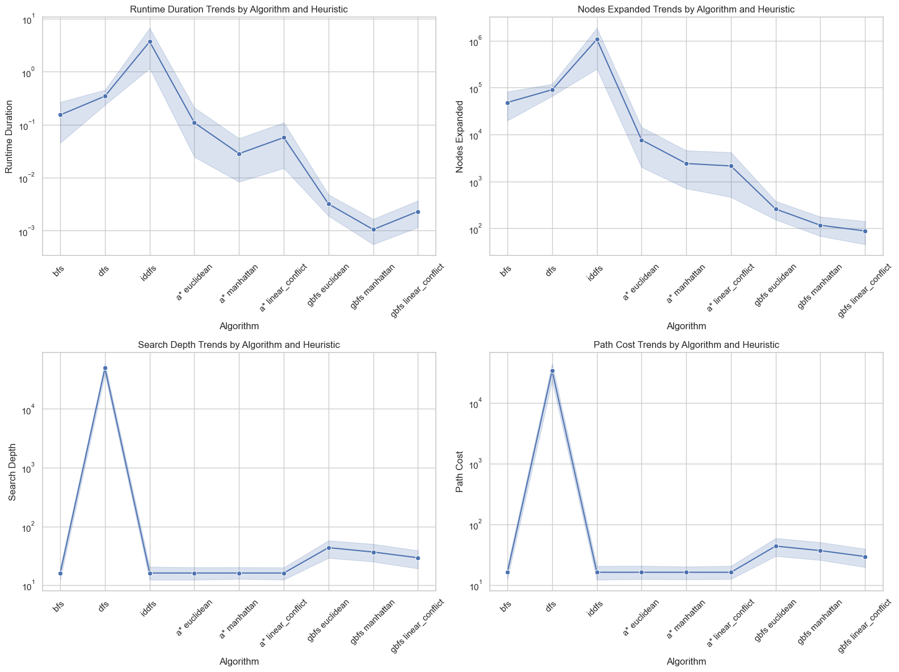
    
    ### Heuristic Performance Analysis for A* and Greedy BFS
    
    Among the heuristics applied to **A*** and **GBFS**, they performed similarly, with some distinctions:
    
    - **Node Expansion**: The **Linear Conflict** heuristic consistently minimized node expansions and often achieved the lowest path cost, making it highly efficient.
    - **Runtime**: The **Manhattan** heuristic resulted in the lowest runtimes, making it the fastest option across most cases.
    
    Overall, Linear Conflict is preferred when minimizing node expansions and cost, while Manhattan is optimal for quick runtimes.
    <table>
        <tr>
            <td>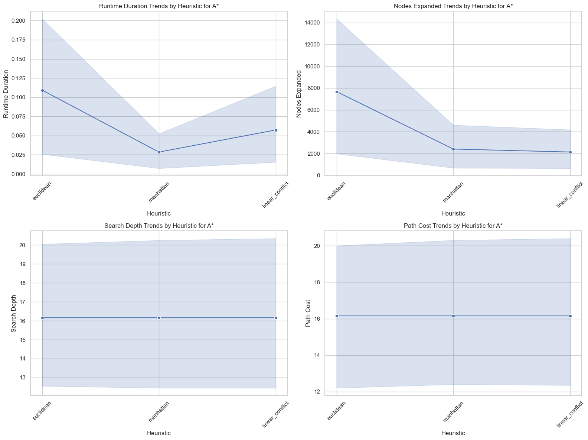</td>
            <td>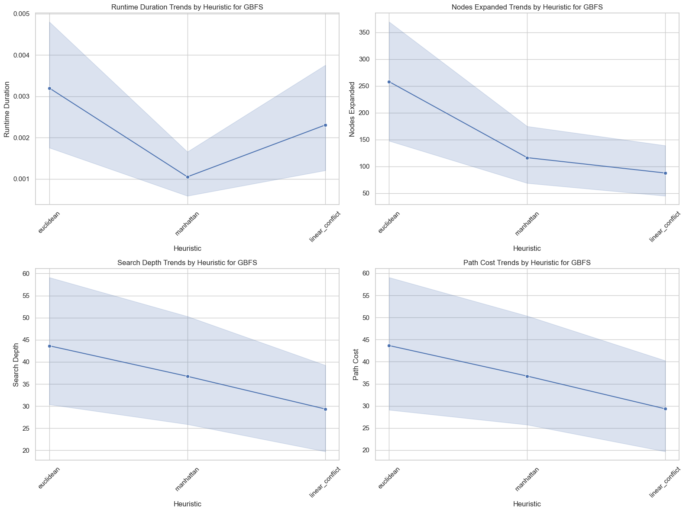</td>
        </tr>
    </table>
    
    ### Admissibility of Heuristics
    
    1. **Manhattan Distance**: Admissible; never overestimates the cost to reach the goal.
    2. **Euclidean Distance**: Admissible; measures straight-line distance without overestimation.
    3. **Linear Conflict**: Admissible; adds cost for conflicting tiles without exceeding the true cost.
    
## Deployment
You can access the deployed version of the 8-Puzzle Game Solver [here](https://8-puzzle.streamlit.app/).

## **Sample runs**
    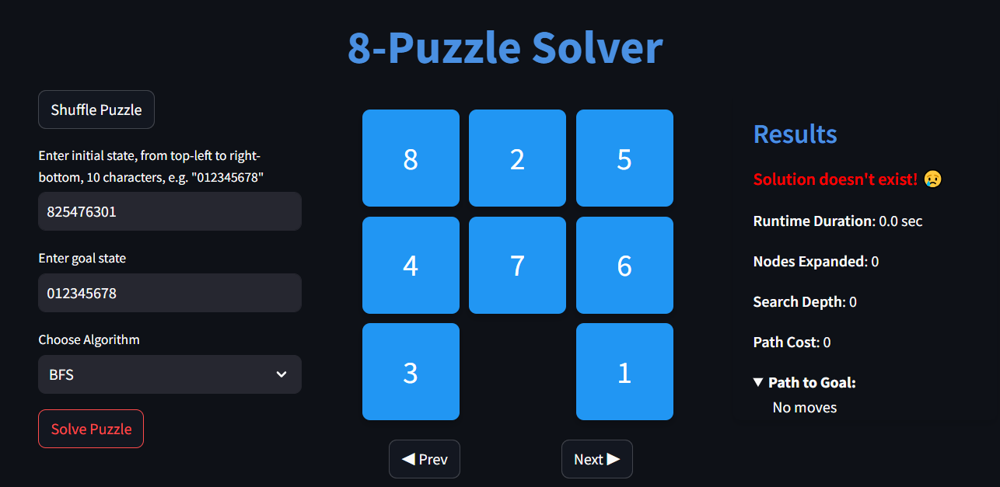
    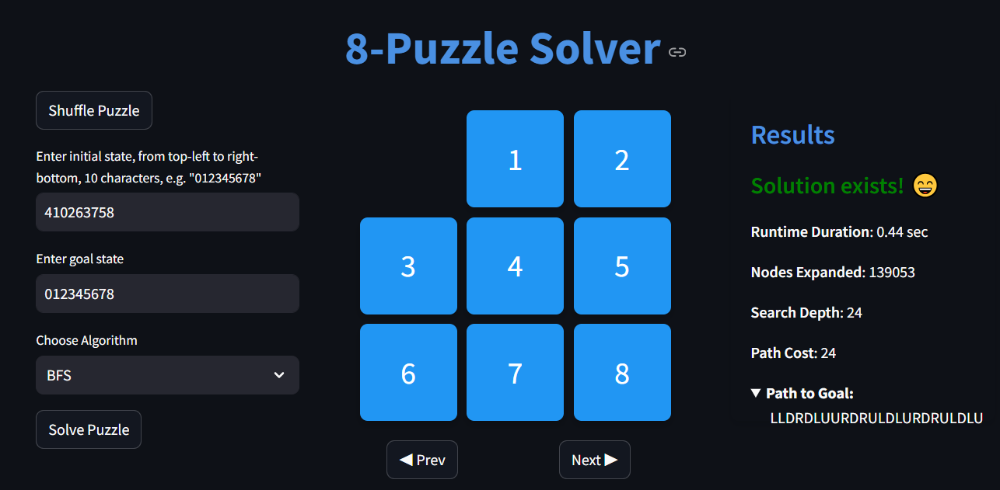
    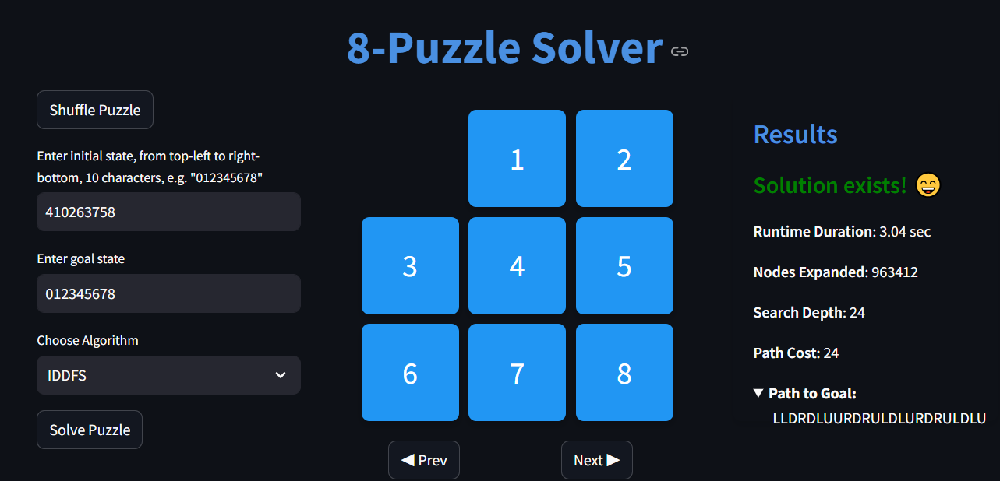
    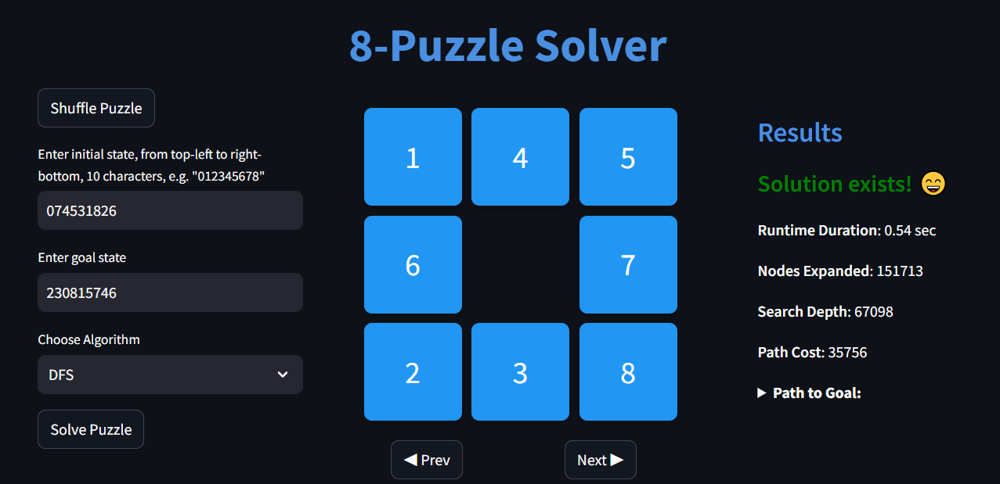
    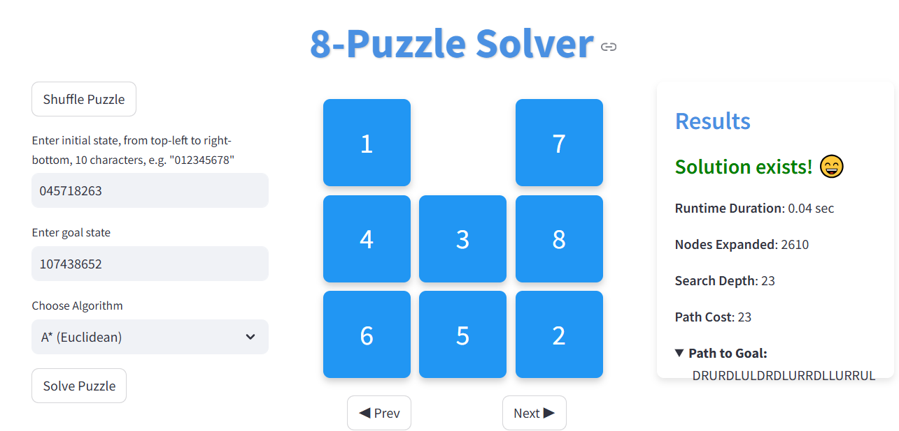
    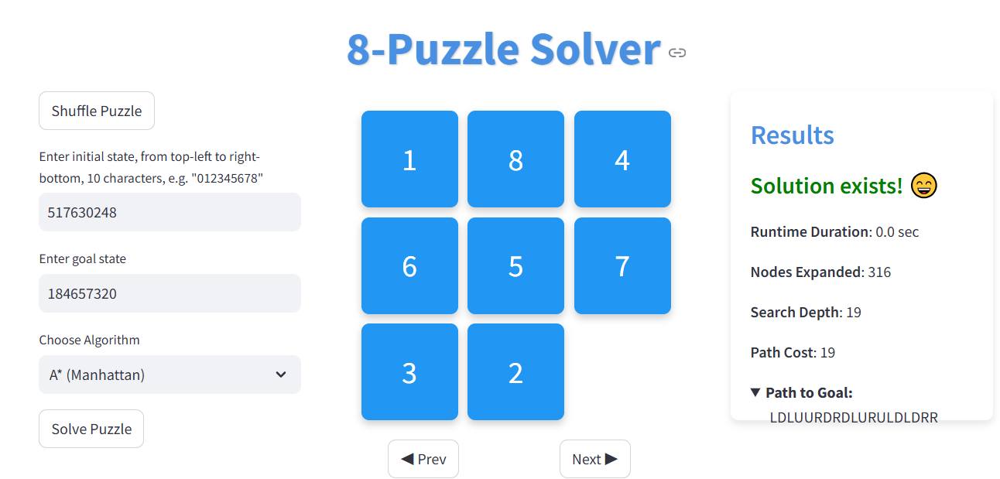
    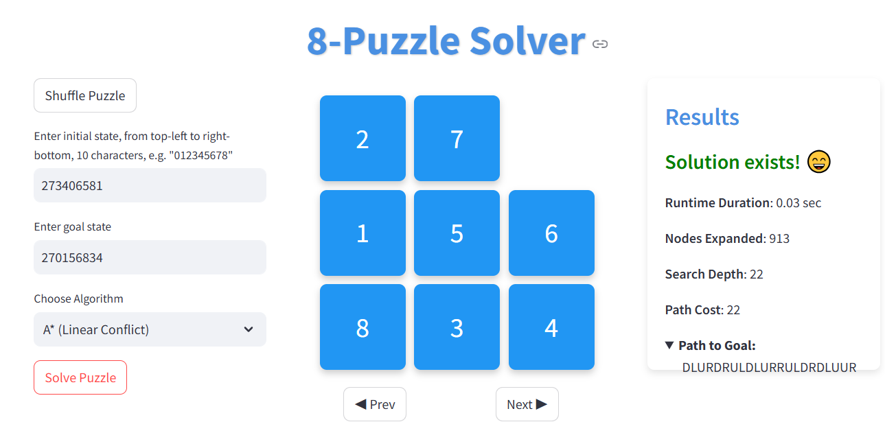
    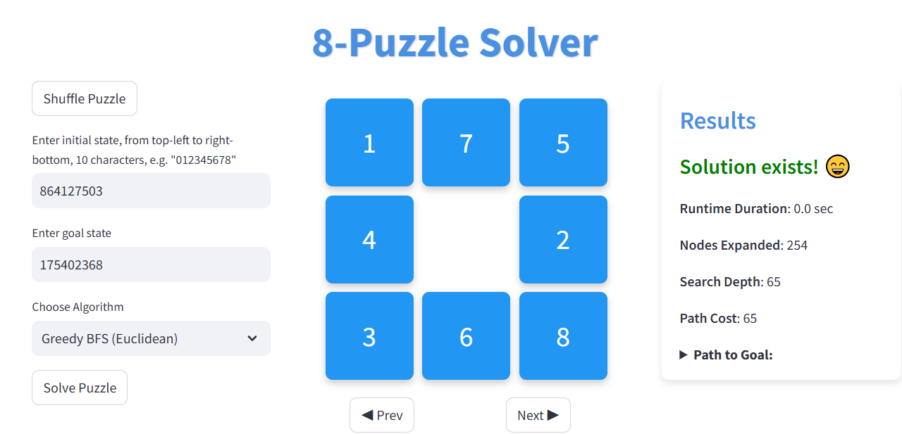
    
## **Contributors**

- AbdElRahman Bassam
- AbdElRahman Osama 
- Ahmed Youssef